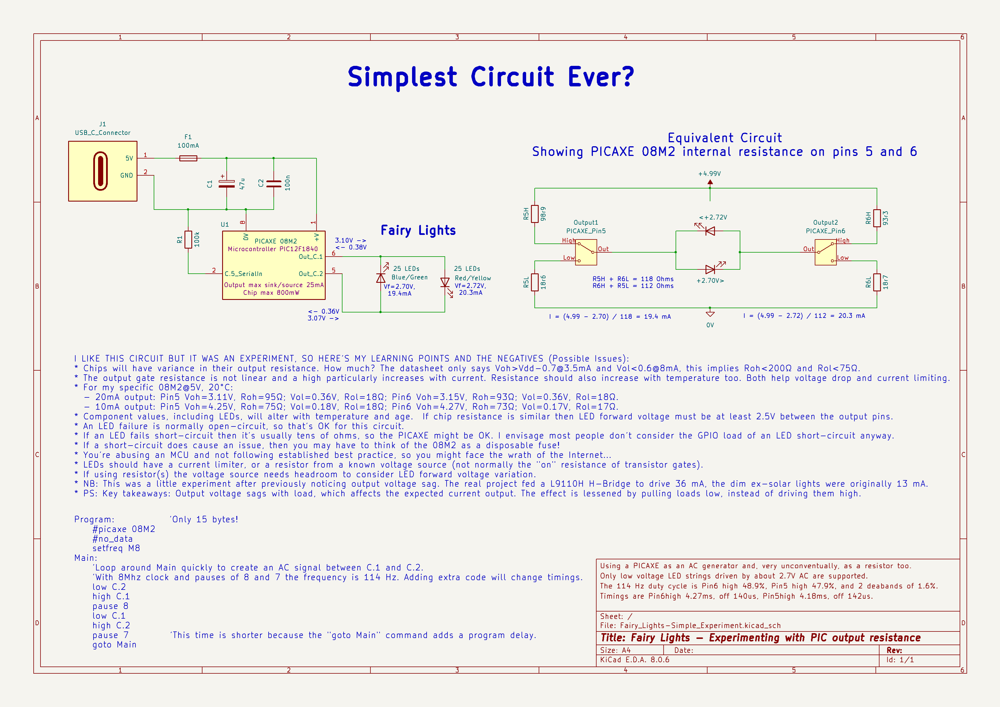

# Fairy Lights - Simple Experiment, GPIO without a series resistor

This experiment records some findings about PICAXE output resistance and voltage drop with load.  It exists because of the fun in creating AC for LED strings without the usual series resistor.  This goes against best practise of using a resistor or current limiter with LEDs and, as a word of caution, you must prove sufficient LED forward voltage first!

A PICAXE 08M2 managed to raise the current for a set of fairly dim ex-solar power lights from 13mA to 20mA.  The eventual project was always going to use a L9110 H-Bridge to drive more than the PICAXE maximum 25mA though.  At 8MHz the 08M2 toggled 2 outputs at 114Hz and provided 140us deadbands to prevent shoot-through current on the H-Bridge.

For future reference, the Electronics Schematic provides a record of the circuit, the PICAXE output voltages and internal resistances at different load currents, plus some thoughts on the effects of LED failures.

Full details are contained in the:
- [Electronics_Schematic](./Electronics_Schematic) produced in KiCad v8.0.6.
- [Software](./Software/Fairy_Lights-Simple_Experiment.bas) written in PICAXE BASIC with the PICAXE Editor v6.2.0.0.

## Licence
Contents of this project are covered by different licences:

- The PICAXE BASIC software has the [MIT](https://choosealicense.com/licenses/mit/) Licence.  
- All other materials have the [CERN OHL v2 Permissive](https://choosealicense.com/licenses/cern-ohl-p-2.0/) licence.

